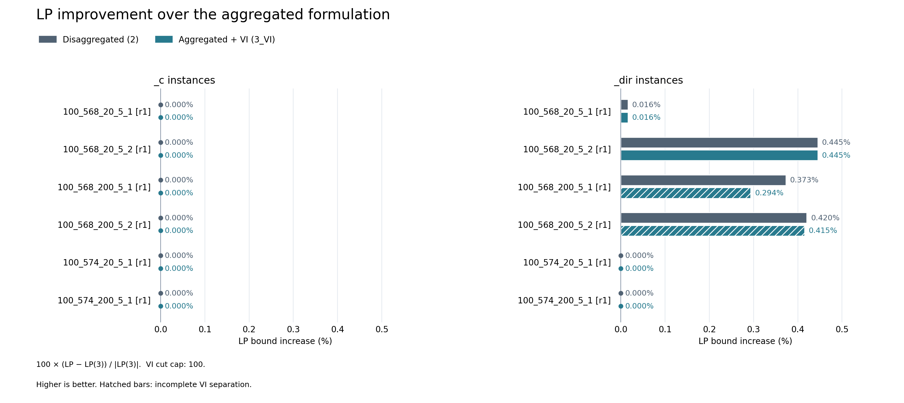

# Three LP relaxations: 100-node c/dir experiment

Run date: 2026-09-25. All 36 solves reached OPTIMAL: 12 instances, three formulations, one repetition. No comparisons were excluded.

The instance family contains six c and six dir instances, with 568 or 574 edges, 20 or 200 journeyers, and five intruders. Every method starts from a fresh model. Settings: 300 seconds per method (construction, solving, and separation), seed 0, one thread, no memory cap. The VI formulation uses only the first/lower subset family, capped at 100 cuts, 20 per round, 100 rounds, and violation tolerance 1e-6.

For integer use, VI separation is restricted to the root node. This experiment solves continuous models through a solve/separate/reoptimize loop.

## Results

| Family | Instances | VI improved | Mean VI increase | Mean disaggregated increase | Complete VI separation |
| --- | ---: | ---: | ---: | ---: | ---: |
| c | 6 | 0 | 0.000000% | 0.000000% | 6 |
| dir | 6 | 4 | 0.195000% | 0.209101% | 4 |

Percentages are 100 × (LP(method) − LP(3)) / |LP(3)|; group means are unweighted means of instance percentages. All three LP values coincide on the c instances. VI improves four of the six dir instances and matches the disaggregated value on 10 of 12 instances overall.

The two incomplete VI runs reached the 100-cut cap: 100_568_200_5_1dir closes 78.7591% of the aggregated-to-disaggregated LP gap; 100_568_200_5_2dir closes 98.7151%. Their reported OPTIMAL status applies to the model with the selected cuts. These are not fully separated VI bounds.

All results satisfy LP(3) ≤ LP(3_VI) ≤ LP(2), within numerical tolerance. Complete VI separation matches LP(2). The total reported method runtime was 109.65 seconds; individual runtimes are in the raw CSV. One repetition was used, so runtime differences are descriptive rather than statistical performance estimates.

| Instance | Aggregated (3) | Disaggregated (2) | Aggregated + VI | VI increase | Cuts | Complete |
| --- | ---: | ---: | ---: | ---: | ---: | --- |
| 100_568_20_5_1c | 9809.866814 | 9809.866814 | 9809.866814 | 0.000000% | 0 | True |
| 100_568_20_5_1dir | 9725.946753 | 9727.513391 | 9727.513391 | 0.016108% | 42 | True |
| 100_568_20_5_2c | 12899.348027 | 12899.348027 | 12899.348027 | 0.000000% | 0 | True |
| 100_568_20_5_2dir | 12787.792840 | 12844.723601 | 12844.723601 | 0.445196% | 19 | True |
| 100_568_200_5_1c | 115953.461375 | 115953.461375 | 115953.461375 | 0.000000% | 0 | True |
| 100_568_200_5_1dir | 114149.576489 | 114575.247315 | 114484.830881 | 0.293697% | 100 | False |
| 100_568_200_5_2c | 121273.250503 | 121273.250503 | 121273.250503 | 0.000000% | 0 | True |
| 100_568_200_5_2dir | 119510.493755 | 120012.912583 | 120006.457060 | 0.414996% | 100 | False |
| 100_574_20_5_1c | 12916.763306 | 12916.763306 | 12916.763306 | 0.000000% | 0 | True |
| 100_574_20_5_1dir | 12862.786224 | 12862.786224 | 12862.786224 | 0.000000% | 0 | True |
| 100_574_200_5_1c | 109804.829027 | 109804.829027 | 109804.829027 | 0.000000% | 0 | True |
| 100_574_200_5_1dir | 109804.829027 | 109804.829027 | 109804.829027 | 0.000000% | 0 | True |



[Percentage PDF](lp_improvement.pdf) · [Absolute improvement PDF](lp_improvement_absolute.pdf) · [Raw results](../lp_100_node_20260925.csv) · [Matched objectives](lp_comparison.csv) · [Group summary](summary.csv) · [Run log](../lp_100_node_20260925.log) · [Inputs, settings, and source hashes](manifest.json)

## Reproduce

From the repository root:

```bash
python testing_valid_inequalities.py 'instances/100_*.json' \
    --max-cuts 100 --max-cuts-per-round 20 --max-iterations 100 \
    --time-limit 300 --solver-seed 0 --threads 1 \
    --csv results/lp_100_node_20260925.csv
python plot_valid_inequalities.py results/lp_100_node_20260925.csv \
    --output-dir results/lp_100_node_20260925
python plot_valid_inequalities.py results/lp_100_node_20260925.csv \
    --output-dir results/lp_100_node_20260925 --metric absolute
```

A working Gurobi license is required. The executed run used /Users/victorbucarey/anaconda3/bin/python; software versions and file hashes are recorded in manifest.json. Re-running these commands replaces this experiment output.

Before the experiment, 131 targeted tests passed (one unrelated platform memory-detection test was deselected). The plot reader was also checked for correct matching, percentage and gap calculations, rejection of interrupted results, undefined zero-baseline percentages, and duplicate detection.
